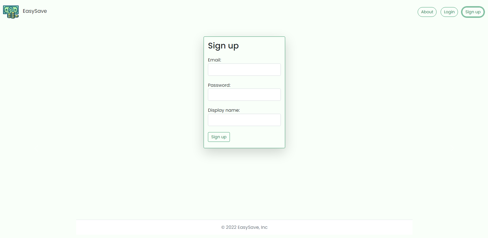
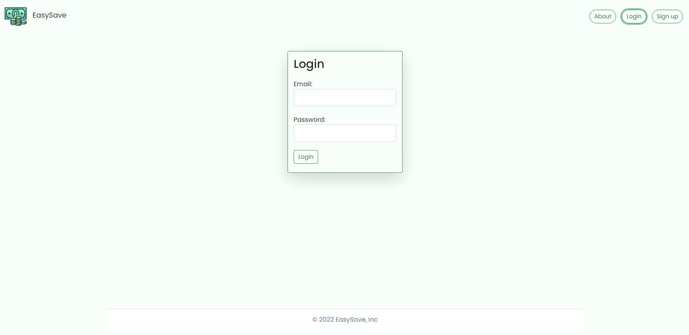
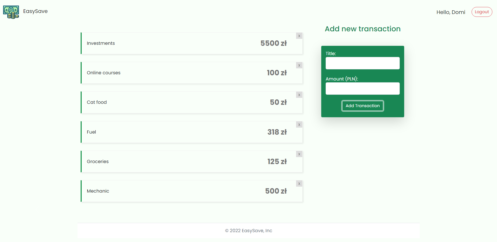
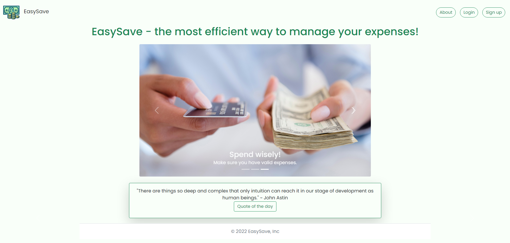
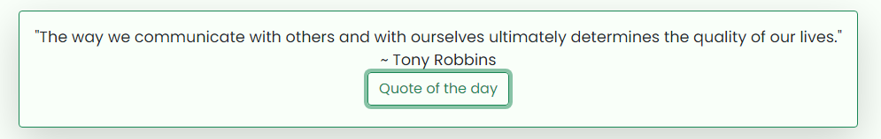

# EasySave 💰

A simple application that allows the user to manage their expenses.

## Table of contents 📋 
* [General info](#general-info)
* [Tech Stack](#tech-stack)
* [Preview](#preview)
* [Authors](#authors)
* [License](#license)

## General info 🔍
The main goal of this application is to track the user's expenses. It uses Firebase at the backend side, and thanks to that provides the user with authentication and reliable database. Additionally, the app fetches data from an external API and shows quote of the day (Simple Quote Generator In React Hooks). React.js makes the UI responsive and acessible for everyone. 

## Tech Stack 💻
* Firebase
* React.js
* Bootstrap

## Preview 📸
This application aims to be an intuitive tool for everyday use.
### Signup Screen 
Allows the user to create an account and sign up.

### Login Screen
After the account is created, user can log in to the app, using the same credentials they signed up with.

### Main Page
On the main page the user is able to add a transaction by giving it a title and amount spent.

### About Screen
About page welcomes the user with a stunning carousel that helps with money management and gives some useful tips.

### Quote Component
Below the carousel, user can find an inspirational quote and author. The user can see a different quote simply by clicking the button "Quote of the day".

## Authors 📖
* Dominika Drela
* Maciej Winnik

## License 🧾
MIT
